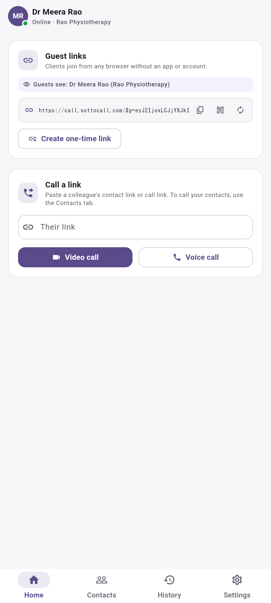
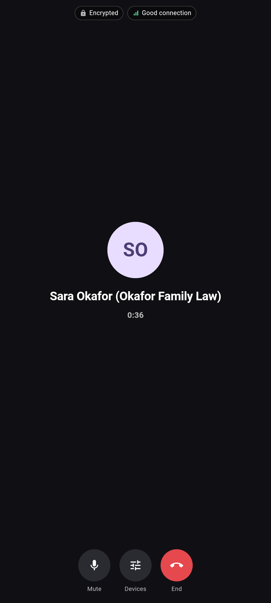
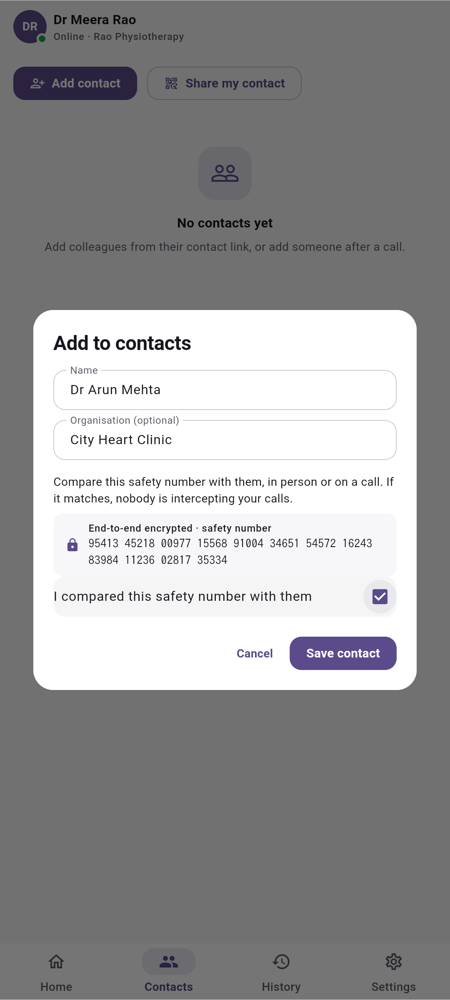

<h1>
  <picture>
    <source media="(prefers-color-scheme: dark)" srcset="docs/brand/sotto-logo-dark.png">
    
  </picture>
</h1>

**Speak freely. Nothing about you is kept on the server.**

[](https://github.com/rbr48/sotto/actions/workflows/ci.yml)
[](LICENSE)

Sotto is a privacy-first calling and messaging app for professionals and their clients: lawyers, therapists, doctors, accountants, journalists and small organisations.

- Clients join from **Chrome, Edge, Firefox or Safari** with a link: no app, no account
- **End-to-end encrypted** 1:1 calls, and **text messages** between contacts
- **No user data kept on the server**: nothing is written to disk, and undelivered messages wait in memory for up to 60 seconds
- **Self-host** with one command, or use the hosted beta at `call.sottocall.com`
- Planned, not yet built: consent-based recording on the professional's own device

<p align="center">
  
  
  
</p>

The name comes from *sotto voce*: speaking quietly so that only the listener hears.

**Status: v0.2.0**, the [latest release](https://github.com/rbr48/sotto/releases/latest). Built so far: guest links, one-command self-hosting, the Windows, Linux and Android apps, and text messages between contacts. What is still open is in [`docs/ROADMAP.md`](docs/ROADMAP.md).

**Package name / application ID:** `com.izhaanintellect.sotto` on Android (publisher: Izhaan Intellect)

## Download

| Platform | Get it | Notes |
|---|---|---|
| Android | [`sotto-android.apk`](https://github.com/rbr48/sotto/releases/latest/download/sotto-android.apk) | Install the APK directly. Google Play and F-Droid: see [`docs/APP_STORES.md`](docs/APP_STORES.md). |
| Windows | [`sotto-windows-x64-setup.exe`](https://github.com/rbr48/sotto/releases/latest/download/sotto-windows-x64-setup.exe), or the [portable zip](https://github.com/rbr48/sotto/releases/latest/download/sotto-windows-x64.zip) | Not code-signed yet, so SmartScreen may warn about an unknown publisher: choose *More info*, then *Run anyway*. |
| Linux | [AppImage](https://github.com/rbr48/sotto/releases/latest/download/sotto-linux-x86_64.AppImage), [.deb](https://github.com/rbr48/sotto/releases/latest/download/sotto-linux-amd64.deb) or [tar.gz](https://github.com/rbr48/sotto/releases/latest/download/sotto-linux-x64.tar.gz) | The AppImage and .deb are built on Ubuntu 22.04, the oldest release supported; Ubuntu 22.04 or newer and Debian 12 or newer are expected to run them. The app needs a keyring (GNOME Keyring or KWallet) to keep its keys. |
| Browser | A guest link, or [`call.sottocall.com`](https://call.sottocall.com/) | Chrome, Edge, Firefox or Safari. Guests keep nothing after the tab closes. |

- There is no iPhone or Mac app yet. Those devices join through Safari.
- On Windows, and on Linux desktops with a system tray (KDE and Ubuntu, for example; plain GNOME has none), Sotto keeps running in the tray, so calls still ring while the window is closed. It is on by default; to turn it off, see Settings → Desktop.
- On Android, with *Ring even when Sotto is closed* on (Settings → Calls while Sotto is closed), calls ring and messages and waiting guests show a notification while the app is closed. This is not yet verified on Pixel, Samsung or Xiaomi phones with battery savers on, and some Android makers stop background services.
- Every release includes `SHA256SUMS.txt`, with each file's SHA-256 checksum, and the Android release notes give the signing certificate's fingerprint. See [Building and publishing releases](docs/RELEASES.md) for the certificate check.

## Try it

**Online:** open [`call.sottocall.com`](https://call.sottocall.com/), press **Start**, and enter a name. A browser session keeps nothing after the tab closes or reloads, unless you choose *Remember me on this browser* on your own computer. Share a guest link with a "client" on another device, or your contact link (**Contacts → Share my contact**) with a "colleague". Compare the safety numbers. `?selftest=1` runs the crypto self-test in the browser.

**Locally:** you need Node.js 20 or later and Flutter 3.47.6 (the version CI uses). On Linux, first install the build packages listed in the Linux job of [`.github/workflows/ci.yml`](.github/workflows/ci.yml). On Ubuntu 22.04, run `sudo apt-get remove -y libunwind-14-dev` first, as that job does.

```bash
# Relay on this computer, reachable from this computer only
cd server && npm ci && npm run build && HOST=127.0.0.1 npm start

# App (another terminal): desktop, or Chrome for the web version
cd app && flutter run -d linux --dart-define=SOTTO_RELAY_URL=ws://localhost:8080/relay
cd app && flutter run -d chrome --dart-define=SOTTO_RELAY_URL=ws://localhost:8080/relay
```

Two windows on this computer work with the commands above: the Linux app plus Chrome, or two Chrome windows. Do not start the Linux app twice: Sotto runs one desktop window per user, and a second start exits at once. Open the app in both, go through onboarding, then add each other: one person presses **Contacts → Share my contact**, and the other pastes that link under **Contacts → Add contact**. Compare the safety numbers, then press **Video call**. You can also paste a link under **Home → Call a link**.

For two computers on the same network, start the relay with `npm start` (it listens on all interfaces, port 8080) and build each app with `--dart-define=SOTTO_RELAY_URL=ws://<relay-LAN-IP>:8080/relay`. Local calls connect directly. To test *Hide my IP address* locally, also run a TURN server on the relay's computer, as in step 0 of [`e2e/README.md`](e2e/README.md), and start the relay with `SOTTO_STUN_URLS`, `SOTTO_TURN_URLS` and `SOTTO_TURN_SECRET` set to the values in [`.github/workflows/ci.yml`](.github/workflows/ci.yml) (lines 131–133). Those values point at `127.0.0.1`, so they work only on the relay's own computer. On Linux the app needs a Secret Service (GNOME Keyring or KWallet) to keep its keys; without one it offers a session that saves nothing.

## Self-host

Organisations can run their own Sotto server with one command:

```bash
git clone https://github.com/rbr48/sotto && cd sotto
sudo ./infra/install.sh
```

You need a Linux server with a public IP address and at least 2 GB of RAM (the installer adds a 2 GB swap file when memory plus swap is under about 2.5 GB, because building the web app needs that much), and a domain whose DNS A record points to it (with any Cloudflare proxy turned off). Open TCP 80, 443 and 3478, UDP 443, 3478 and 49152–65535, and TCP 5349 once the installer enables TURN over TLS, in any firewall your hosting provider runs. The full guide is [`docs/SELF_HOSTING.md`](docs/SELF_HOSTING.md).

## Security status

What holds today:

- Call setup and chat set-up are sealed end to end with libsodium (sealed boxes: X25519 and XSalsa20-Poly1305; Ed25519 signatures). Call audio and video use WebRTC's DTLS-SRTP, and its key fingerprints travel inside the sealed call setup, so neither the relay nor the TURN server can decrypt a call.
- Text messages go directly between the two devices over an encrypted WebRTC data channel. The relay carries only sealed set-up messages, never the text, and only your contacts can open a chat with you.
- The relay and the TURN server keep no user data on disk: both containers run read-only, and TURN's logs are discarded. The relay's only log lines are its start and stop messages, which Docker keeps in a log capped at 1 MB. Undelivered messages wait in memory for up to 60 seconds. The web server keeps only TLS certificate data and no access logs, but its error log, which Docker keeps in a log capped at 1 MB, can show a visitor's IP address when a request fails.
- A relay that tampers with, replays or re-addresses call and chat set-up messages is detected: each one is signed by its sender and checked for age (2 minutes) and for replay. Chat text is not signed message by message; it relies on the data channel's encryption. The replay check is kept in memory, so a message replayed within 2 minutes after an app restart is accepted. Logins are signed challenges.
- Guest links are signed. Safety numbers reveal a man in the middle, once the two people compare them.
- The code is open, so all of this can be checked.

What doesn't hold yet (details in [`docs/THREAT_MODEL.md`](docs/THREAT_MODEL.md)):

- **No independent security audit yet**; one is planned before the public launch.
- **Everyone who uses the web app runs the code the server sends them**, guests and professionals alike. A compromised or compelled server could send modified code. Run your own server, or use one you trust; the apps don't have this problem.
- **Call and chat set-up have no forward secrecy yet**; call media and chat message text do. A stolen identity key could decrypt recorded past set-up messages, which hold IP addresses, codec and connection details, the names shown on calls, guest link secrets and timing. They don't hold the conversation.
- **Safety numbers only help if the two people compare them.** Until they do, a contact is not verified, and a contact link's name is whatever its sender chose.
- **While the apps are connected, the relay sees** who is online, who sends to whom and when (calls and chat set-ups), message sizes and IP addresses. The TURN server sees the IP addresses, volume and timing of relayed calls and chats. The web server sees each visitor's IP address. The relay and the TURN server store no user data.
- **A relay can drop or delay messages without anyone noticing**; calls and chats then fail or time out.
- **A sender can tell whether someone is online.** The relay reports whether a message was *delivered* or *queued* when the sender asks for that, and the apps answer a stranger's call with *ringing* and a stranger's chat with a decline. So anyone who can send to a Sotto ID can learn whether it is online.
- **The other person can see your IP address** unless you turn on *Hide my IP address*, which sends calls and chats through the TURN server.
- **Call links and contact links are permanent**: anyone who has one can ring you. Give clients a guest link instead, which can be replaced or used once.
- **Your contacts, history and keys** are encrypted on the device, with their keys kept in the device's keystore. In a browser, they are kept only with *Remember me*, under a non-extractable key in the browser's storage. The app lock (a PIN) hides the screens and guards sensitive settings, but it does not encrypt anything. Malware on the device, or someone who can unlock it, can read them.
- **Chat history stays on your devices until you delete it.** It is never deleted automatically, and it is included in backups.
- **The apps check GitHub for updates once a day by default**, and each time they start. The check shows GitHub your IP address and the Sotto version. Turn this off in Settings → Updates. The Google Play build does not check, because Play delivers its updates.
- **"Remember me on this browser" is only as safe as that browser profile.** In a browser, the app-lock PIN is checked with a fast keyed hash rather than Argon2id, in every session and not only with *Remember me*. *Remember me* is off by default; use it on your own computer only.
- **Devices whose clocks are more than 2 minutes off** cannot exchange messages.

## Repository

| Folder | What it is |
|---|---|
| `app/` | Flutter app: Android, Windows, Linux and the browser (web) |
| `server/` | Relay server (Node.js + TypeScript). Keeps nothing on disk; holds undelivered messages in memory for up to 60 seconds |
| `infra/` | Docker Compose deployment (relay, web app behind Caddy, coturn). `install.sh` sets it up for self-hosting and for the test server |
| `e2e/` | End-to-end tests: real calls and messages between headless browsers, through the real relay and TURN server |
| `packaging/` | Installer and package builds: Windows (Inno Setup), Linux (.deb, AppImage) |
| `fastlane/` | Google Play and F-Droid store listing: text, images and change logs |
| `website/` | The public sottocall.com page (static HTML) |
| `tools/crypto-vectors/` | Independent implementation of the protocol that generates crypto test vectors |
| `tools/icons/`, `tools/sounds/` | Generators for the logo and every app icon, and for the bundled sounds |
| `.github/` | CI and release workflows |
| `docs/` | Strategy, roadmap, features and deployment guides |

## Development checks

```bash
cd server && npm ci && npm run lint && npm run format:check && npm run typecheck && npm test && npm run build
cd app && flutter pub get && dart format --output=none --set-exit-if-changed lib test && flutter analyze && flutter test
```

CI also runs the end-to-end browser tests, the crypto test-vector check, the installer tests and the dependency scans. The end-to-end test needs the relay, a TURN server and a web build with `SOTTO_TEST_HOOKS=true` running. See [`e2e/README.md`](e2e/README.md) and [`.github/workflows/ci.yml`](.github/workflows/ci.yml).

## Documents

- [Product strategy, technical plan & roadmap](docs/ROADMAP.md)
- [Feature list](docs/FEATURES.md)
- [Messaging plan](docs/MESSAGING_PLAN.md)
- [Self-hosting](docs/SELF_HOSTING.md)
- [Deploying the test server](docs/DEPLOY_TEST_SERVER.md)
- [Protocol: identities, envelopes and chat](docs/PROTOCOL.md)
- [Threat model](docs/THREAT_MODEL.md)
- [Network test matrix](docs/NETWORK_TESTING.md)
- [Building and publishing releases](docs/RELEASES.md)
- [Code signing (SignPath) setup](docs/CODE_SIGNING.md)
- [Google Play and F-Droid](docs/APP_STORES.md)
- [Translating Sotto](docs/TRANSLATING.md)
- [Privacy policy](https://call.sottocall.com/privacy.html) and [terms of use](https://call.sottocall.com/terms.html)

## Plans, licence and languages

- Sotto is free to use and to self-host. Planned, not yet available: a paid hosted plan (Pro) and a paid self-hosted licence (Business); see [`docs/FEATURES.md`](docs/FEATURES.md).
- The app is available in English, Bangla and Arabic, but not every screen is translated yet. The Bangla and Arabic text has not yet been reviewed by a native speaker.

## Contact & Support

Contacts for the hosted service at `call.sottocall.com`:

- **Sotto Live Call Center:** [Call Support](https://call.sottocall.com/#c=n3qJ6HlYC0WI3DU_ixZTW6VaXCTX04zQTw5FjPj20CQ) (private, end-to-end encrypted call)
- **Contact:** [contact@sottocall.com](mailto:contact@sottocall.com)
- **Support:** [support@sottocall.com](mailto:support@sottocall.com)

> Sotto cannot call emergency services. In an emergency, use a phone to call your local emergency number.

## License

This project is licensed under the [GNU Affero General Public License, version 3 or later](LICENSE) (AGPL-3.0-or-later).

Copyright (C) 2026 [Izhaan Intellect](https://izhaanintellect.fun).
