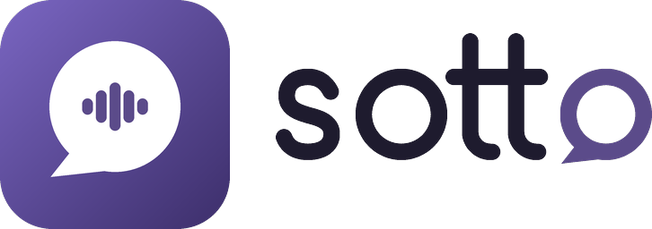

<h1>
  <picture>
    <source media="(prefers-color-scheme: dark)" srcset="docs/brand/sotto-logo-dark.png">
    
  </picture>
</h1>

**Speak freely. Nothing is kept.**

Sotto is a privacy-first audio and video calling app for professionals and their clients: lawyers, therapists, doctors, accountants, journalists and small organisations.

- Clients join from **any browser** with a link: no app, no account
- **End-to-end encrypted** 1:1 calls
- **Zero server storage**: the server only connects calls, in memory
- **Consent-based recording** kept only on the professional's device
- **Self-host** with one command (a hosted service is planned)

The name comes from *sotto voce*: speaking quietly so that only the listener hears.

> Status: **Phase 7 — self-hosting and the desktop app.** Organisations can run their own Sotto server with one command (`sudo ./infra/install.sh`, see [`docs/SELF_HOSTING.md`](docs/SELF_HOSTING.md)) and point the app at it (*Settings → Server*). On Windows and Linux, Sotto keeps running in the system tray and shows notifications for knocking guests and incoming calls; calls ring with a bundled ringtone. Phase 6 brought onboarding, an encrypted vault for contacts, history and notes, the app lock, encrypted backups and contacts from signed links or QR codes. Clients still join from any browser with a guest link; all call setup is end-to-end encrypted and the servers store nothing.

**Package name / application ID:** `com.izhaanintellect.sotto` (publisher: Izhaan Intellect)

## Repository

| Folder | What it is |
|---|---|
| `app/` | Flutter app: Android, Windows, Linux and the browser (web) |
| `server/` | Relay server (Node.js + TypeScript). Stores nothing |
| `infra/` | Docker Compose + Caddy deployment for the test server |
| `e2e/` | End-to-end tests: real calls between headless browsers through the real relay and TURN server |
| `tools/crypto-vectors/` | Independent implementation of the protocol that generates crypto test vectors |
| `tools/icons/`, `tools/sounds/` | Generators for the logo and every app icon, and for the bundled sounds |
| `docs/` | Strategy, roadmap, features and deployment guides |

## Security status

What holds today:

- Call setup is sealed end to end with libsodium (sealed boxes: X25519 and XSalsa20-Poly1305; Ed25519 signatures). Audio and video use WebRTC's DTLS-SRTP; its key fingerprints travel inside the sealed call setup, so neither the relay nor the TURN server can decrypt a call.
- Servers keep nothing on disk; guest links are signed, and safety numbers reveal a server in the middle.
- The code is open, so all of this can be checked.

What doesn't hold yet (details in [`docs/THREAT_MODEL.md`](docs/THREAT_MODEL.md)):

- **No independent security audit yet**; one is planned before the public launch.
- **Browser guests run the code the server sends them.** A compromised or compelled server could send modified code. Run your own server, or use one you trust; the apps don't have this problem.
- **Call setup has no forward secrecy yet** (call media does): a stolen device key could decrypt recorded past call-setup messages, which hold IP addresses and timing, not the conversation.
- **While calls run, the servers see metadata**: who is online, who calls whom and when, and IP addresses. It is kept in memory only, never stored.
- **"Remember me on this browser" is only as safe as that browser profile.** It is off by default; use it on your own computer only.

## Try it

**Online** (after the test server is deployed): open `https://call.sottocall.com/` on one device and enter a name (a browser session keeps nothing after the tab closes or reloads, unless you choose *Remember me on this browser* on your own computer; the apps always keep your contacts and history). Share a guest link with a "client" on another device, or your contact link (Contacts → Share my contact) with a "colleague". Compare the safety numbers. `?selftest=1` runs the crypto self-test in the browser.

**Locally:**

```bash
# Relay with proof-of-concept rooms
cd server && npm ci && npm run build && npm start

# App (another terminal) — desktop, or Chrome for the web version
cd app && flutter run -d linux --dart-define=SOTTO_RELAY_URL=ws://localhost:8080/relay
cd app && flutter run -d chrome --dart-define=SOTTO_RELAY_URL=ws://localhost:8080/relay
```

Open the app on two devices or windows, go through onboarding, then add each other from **Contacts → Share my contact** (or paste a link in **Home → Call a link**) and press **Video call**. On Linux the app needs a Secret Service (GNOME Keyring or KWallet) to keep its keys; without one it offers a session that saves nothing.

## Development checks

```bash
cd server && npm run lint && npm run typecheck && npm test
cd app && flutter analyze && flutter test
```

See [`e2e/README.md`](e2e/README.md) for the end-to-end call test.

## Documents

- [Product strategy, technical plan & roadmap](docs/ROADMAP.md)
- [Feature list](docs/FEATURES.md)
- [Self-hosting](docs/SELF_HOSTING.md)
- [Deploying the test server](docs/DEPLOY_TEST_SERVER.md)
- [Protocol: identities and encrypted envelopes](docs/PROTOCOL.md)
- [Threat model](docs/THREAT_MODEL.md)
- [Network test matrix](docs/NETWORK_TESTING.md)
- [Releases and signed builds](docs/RELEASES.md)

## Before using the name publicly

- [x] Domain: `sottocall.com` (the hosted server is `call.sottocall.com`)
- [ ] Trademark search (local office, USPTO, EUIPO; classes 9 and 38)
- [ ] Play Store / Microsoft Store name check
- [ ] Social handles

## Contact & Support

- **Sotto Live Call Center:** [Call Support](https://call.sottocall.com/#c=n3qJ6HlYC0WI3DU_ixZTW6VaXCTX04zQTw5FjPj20CQ) (private, end-to-end encrypted call)
- **General Inquiries:** [contact@sottocall.com](mailto:contact@sottocall.com)
- **User & Technical Support:** [support@sottocall.com](mailto:support@sottocall.com)

## License

This project is licensed under the [GNU Affero General Public License v3.0](LICENSE) (AGPL-3.0).

Copyright (C) 2026 [Izhaan Intellect](https://izhaanintellect.fun).

